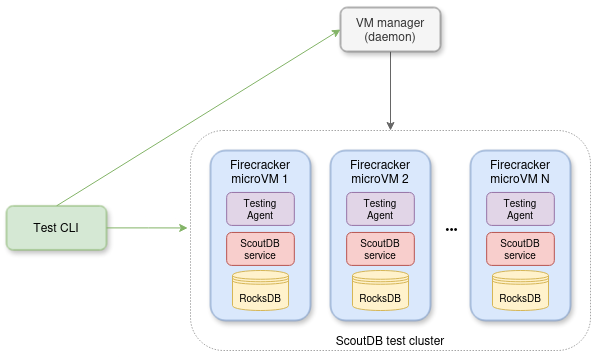

# Testing

The [testing](../cmd/testing) CLI command implements multiple components required during end-to-end testing:

 - Node daemon service to manage [Firecracker](https://github.com/firecracker-microvm/) microVM instance lifecycle. It needs to run as root.
 - Node client which forwards microVM commands (create/start/stop/reset/etc.) to the daemon.
 - Agent service that runs inside the microVM and acts as a bridge, allowing the host to control the guest (start/stop the ScoutDB service, modify system settings, etc).
 - Agent client which forwards service commands (config/start/stop/reset/etc.) to the agent.  
 - The [jepsen](https://jepsen.io/)-style test runner.
 - The [elle](https://github.com/jepsen-io/elle) test result checker.



## Running

### Prerequisites

First, in the root dir, build all docker images `make docker_images`. Then change to `tests` dir and exec `make all` which will:
  - download the Firecracker binary, [guest kernel image](https://github.com/firecracker-microvm/firecracker/blob/main/docs/getting-started.md#running-firecracker), [CNI plugin](https://github.com/containernetworking/plugins) binaries,
  - generate ssh keys,
  - build the `tc-redirect-tap` CNI plugin,
  - build the ext4 filestems,
  - build the `scout/elle_cli` docker image for the [ell-cli](https://github.com/ligurio/elle-cli) tool,
  - make a copy of `testing` and `admin` CLI tools,
  - and place all in the `.work` directory.

### Starting the test cluster

From inside the `.work` dir, start the node daemon service `sudo ./testing node daemon`. Then, in a separate terminal, run the following commands to create, configure and start the cluster:
- `./testing node create 10` to create a few VMs
- `./testing node start` to start the VMs
- `./testing service config` to configure the ScoutDB service inside the VMs (config templates can be customized in the [configs](../tests/configs) dir before running the command)
- `./testing service start` to start the ScoutDB services
- `./testing node ls` should confirm that the nodes and services are running:
```
+----------+---------+-------+---------------+-------+------------------+--------------------------+
|   NODE   |  STATE  |  PID  |      IP       | AGENT |     SERVICE      |           TIME           |
+----------+---------+-------+---------------+-------+------------------+--------------------------+
| scout001 | Running | 46579 | 192.168.13.2  | OK    | Control (active) | 2025-01-08T17:27:23.684Z |
| scout002 | Running | 46674 | 192.168.13.3  | OK    | Control (active) | 2025-01-08T17:27:23.699Z |
| scout003 | Running | 46771 | 192.168.13.4  | OK    | Control (active) | 2025-01-08T17:27:23.695Z |
| scout004 | Running | 46865 | 192.168.13.5  | OK    | Api (active)     | 2025-01-08T17:27:23.7Z   |
| scout005 | Running | 46959 | 192.168.13.6  | OK    | Api (active)     | 2025-01-08T17:27:23.688Z |
| scout006 | Running | 47060 | 192.168.13.7  | OK    | Data (active)    | 2025-01-08T17:27:23.634Z |
| scout007 | Running | 47181 | 192.168.13.8  | OK    | Data (active)    | 2025-01-08T17:27:23.674Z |
| scout008 | Running | 47277 | 192.168.13.9  | OK    | Data (active)    | 2025-01-08T17:27:23.671Z |
| scout009 | Running | 47377 | 192.168.13.10 | OK    | Data (active)    | 2025-01-08T17:27:23.68Z  |
| scout010 | Running | 47473 | 192.168.13.11 | OK    | Data (active)    | 2025-01-08T17:27:23.698Z |
+----------+---------+-------+---------------+-------+------------------+--------------------------+
Max time offset: 65.613742ms
```
Give it a few moments for the cluster to bootstrap, then run:
- `./admin get servers --server 192.168.13.2` which should show that all nodes have registered successfully:
```
+----+----+---------+---------+----------------------+----------------------+---------------------+----------+
| #  | ID |  NAME   |  TYPE   |      REGISTERED      |      LAST SEEN       |       ADDRESS       |   TAGS   |
+----+----+---------+---------+----------------------+----------------------+---------------------+----------+
|  1 |  1 | boot_1  | Control | 2025-01-08T17:25:33Z | 2025-01-08T17:25:33Z | 192.168.13.2:11001  | scout001 |
|  2 |  2 | boot_2  | Control | 2025-01-08T17:25:33Z | 2025-01-08T17:25:33Z | 192.168.13.3:11001  | scout002 |
|  3 |  3 | boot_3  | Control | 2025-01-08T17:25:33Z | 2025-01-08T17:25:33Z | 192.168.13.4:11001  | scout003 |
|  4 |  4 | data_4  | Data    | 2025-01-08T17:25:39Z | 2025-01-08T17:28:57Z | 192.168.13.10:11001 | scout009 |
|  5 |  5 | data_5  | Data    | 2025-01-08T17:25:39Z | 2025-01-08T17:28:58Z | 192.168.13.9:11001  | scout008 |
|  6 |  8 | data_8  | Data    | 2025-01-08T17:25:40Z | 2025-01-08T17:28:54Z | 192.168.13.11:11001 | scout010 |
|  7 |  9 | data_9  | Data    | 2025-01-08T17:25:41Z | 2025-01-08T17:28:58Z | 192.168.13.7:11001  | scout006 |
|  8 | 10 | data_10 | Data    | 2025-01-08T17:25:41Z | 2025-01-08T17:28:58Z | 192.168.13.8:11001  | scout007 |
|  9 |  6 | api_6   | Api     | 2025-01-08T17:25:39Z | 2025-01-08T17:28:58Z | 192.168.13.6:11001  | scout005 |
| 10 |  7 | api_7   | Api     | 2025-01-08T17:25:39Z | 2025-01-08T17:28:58Z | 192.168.13.5:11001  | scout004 |
+----+----+---------+---------+----------------------+----------------------+---------------------+----------+
```
Similarily, confirm that all replicas were assgiend by running:
- `./admin get replicas --server 192.168.13.2`
```
+----+------+---------+--------------+-------+-------+--------+------------------+----------------------+----------------------+----------------------+
| #  | PART | REPLICA |    SERVER    | STATE | READY | LEADER | APPLIED/COMMITED |       CREATED        |      TRANSITION      |       UPDATED        |
+----+------+---------+--------------+-------+-------+--------+------------------+----------------------+----------------------+----------------------+
|  1 |    0 | p0_r1   | data_9 (9)   | Voter | ✓     | TRUE   | 3/3              | 2025-01-08T17:25:49Z | 2025-01-08T17:25:49Z | 2025-01-08T17:37:18Z |
|  2 |    0 | p0_r2   | data_8 (8)   | Voter | ✓     | ✗      | 3/3              | 2025-01-08T17:25:49Z | 2025-01-08T17:25:49Z | 2025-01-08T17:37:15Z |
|  3 |    0 | p0_r3   | data_5 (5)   | Voter | ✓     | ✗      | 3/3              | 2025-01-08T17:25:49Z | 2025-01-08T17:25:49Z | 2025-01-08T17:37:14Z |
|  4 |    1 | p1_r1   | data_4 (4)   | Voter | ✓     | ✗      | 3/3              | 2025-01-08T17:25:49Z | 2025-01-08T17:25:49Z | 2025-01-08T17:37:18Z |
|  5 |    1 | p1_r2   | data_10 (10) | Voter | ✓     | ✗      | 3/3              | 2025-01-08T17:25:49Z | 2025-01-08T17:25:49Z | 2025-01-08T17:37:14Z |
|  6 |    1 | p1_r3   | data_8 (8)   | Voter | ✓     | TRUE   | 3/3              | 2025-01-08T17:25:49Z | 2025-01-08T17:25:49Z | 2025-01-08T17:37:15Z |
|  7 |    2 | p2_r1   | data_9 (9)   | Voter | ✓     | ✗      | 3/3              | 2025-01-08T17:25:49Z | 2025-01-08T17:25:49Z | 2025-01-08T17:37:18Z |
|  8 |    2 | p2_r2   | data_4 (4)   | Voter | ✓     | ✗      | 3/3              | 2025-01-08T17:25:49Z | 2025-01-08T17:25:49Z | 2025-01-08T17:37:18Z |
|  9 |    2 | p2_r3   | data_5 (5)   | Voter | ✓     | TRUE   | 3/3              | 2025-01-08T17:25:49Z | 2025-01-08T17:25:49Z | 2025-01-08T17:37:14Z |
| 10 |    3 | p3_r1   | data_10 (10) | Voter | ✓     | ✗      | 3/3              | 2025-01-08T17:25:49Z | 2025-01-08T17:25:49Z | 2025-01-08T17:37:14Z |
| 11 |    3 | p3_r2   | data_8 (8)   | Voter | ✓     | ✗      | 3/3              | 2025-01-08T17:25:49Z | 2025-01-08T17:25:49Z | 2025-01-08T17:37:15Z |
| 12 |    3 | p3_r3   | data_5 (5)   | Voter | ✓     | TRUE   | 3/3              | 2025-01-08T17:25:49Z | 2025-01-08T17:25:49Z | 2025-01-08T17:37:14Z |
| 13 |    4 | p4_r1   | data_9 (9)   | Voter | ✓     | ✗      | 3/3              | 2025-01-08T17:25:49Z | 2025-01-08T17:25:49Z | 2025-01-08T17:37:18Z |
| 14 |    4 | p4_r2   | data_4 (4)   | Voter | ✓     | ✗      | 3/3              | 2025-01-08T17:25:49Z | 2025-01-08T17:25:49Z | 2025-01-08T17:37:18Z |
| 15 |    4 | p4_r3   | data_10 (10) | Voter | ✓     | TRUE   | 3/3              | 2025-01-08T17:25:49Z | 2025-01-08T17:25:49Z | 2025-01-08T17:37:14Z |
| 16 |    5 | p5_r1   | data_8 (8)   | Voter | ✓     | ✗      | 3/3              | 2025-01-08T17:25:49Z | 2025-01-08T17:25:49Z | 2025-01-08T17:37:15Z |
| 17 |    5 | p5_r2   | data_5 (5)   | Voter | ✓     | ✗      | 3/3              | 2025-01-08T17:25:49Z | 2025-01-08T17:25:49Z | 2025-01-08T17:37:14Z |
| 18 |    5 | p5_r3   | data_9 (9)   | Voter | ✓     | TRUE   | 3/3              | 2025-01-08T17:25:49Z | 2025-01-08T17:25:49Z | 2025-01-08T17:37:18Z |
| 19 |    6 | p6_r1   | data_4 (4)   | Voter | ✓     | ✗      | 3/3              | 2025-01-08T17:25:49Z | 2025-01-08T17:25:49Z | 2025-01-08T17:37:18Z |
| 20 |    6 | p6_r2   | data_10 (10) | Voter | ✓     | ✗      | 3/3              | 2025-01-08T17:25:49Z | 2025-01-08T17:25:49Z | 2025-01-08T17:37:14Z |
| 21 |    6 | p6_r3   | data_8 (8)   | Voter | ✓     | TRUE   | 3/3              | 2025-01-08T17:25:49Z | 2025-01-08T17:25:49Z | 2025-01-08T17:37:15Z |
| 22 |    7 | p7_r1   | data_9 (9)   | Voter | ✓     | ✗      | 3/3              | 2025-01-08T17:25:49Z | 2025-01-08T17:25:49Z | 2025-01-08T17:37:18Z |
| 23 |    7 | p7_r2   | data_4 (4)   | Voter | ✓     | TRUE   | 3/3              | 2025-01-08T17:25:49Z | 2025-01-08T17:25:49Z | 2025-01-08T17:37:18Z |
| 24 |    7 | p7_r3   | data_5 (5)   | Voter | ✓     | ✗      | 3/3              | 2025-01-08T17:25:49Z | 2025-01-08T17:25:49Z | 2025-01-08T17:37:14Z |
| 25 |    8 | p8_r1   | data_5 (5)   | Voter | ✓     | ✗      | 3/3              | 2025-01-08T17:25:49Z | 2025-01-08T17:25:49Z | 2025-01-08T17:37:14Z |
| 26 |    8 | p8_r2   | data_10 (10) | Voter | ✓     | TRUE   | 3/3              | 2025-01-08T17:25:49Z | 2025-01-08T17:25:49Z | 2025-01-08T17:37:14Z |
| 27 |    8 | p8_r3   | data_8 (8)   | Voter | ✓     | ✗      | 3/3              | 2025-01-08T17:25:49Z | 2025-01-08T17:25:49Z | 2025-01-08T17:37:15Z |
| 28 |    9 | p9_r1   | data_9 (9)   | Voter | ✓     | ✗      | 3/3              | 2025-01-08T17:25:49Z | 2025-01-08T17:25:49Z | 2025-01-08T17:37:18Z |
| 29 |    9 | p9_r2   | data_4 (4)   | Voter | ✓     | TRUE   | 3/3              | 2025-01-08T17:25:49Z | 2025-01-08T17:25:49Z | 2025-01-08T17:37:18Z |
| 30 |    9 | p9_r3   | data_10 (10) | Voter | ✓     | ✗      | 3/3              | 2025-01-08T17:25:49Z | 2025-01-08T17:25:49Z | 2025-01-08T17:37:14Z |
+----+------+---------+--------------+-------+-------+--------+------------------+----------------------+----------------------+----------------------+
Max imbalance: 0
```

### Running a test

- `./testing test run` to run a test using the default params (check the cmd file for [more options](../cmd/testing/cmd_test_run.go))
- on completion, it prints the test run identifier: `Completed. run_id=42`
- `./testing test check 42` will validate the result using Elle
- which should print `{"valid?":true}` for success or output the details in the `.work/runs/run_id` dir if it finds validation errors.
